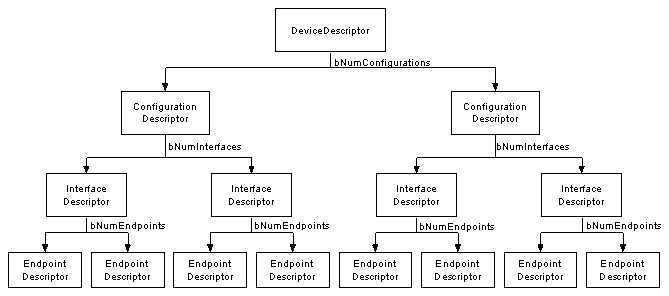

# Firmware and BBIO commands proposal for HydraDancer 26 Jan 2022 Draft v0.2

# 1 HydraDancer Introduction
TODO introduction of HydraDancer ...

## 1.1 HydraDancer Hardware
The HydraDance hardware use 2x HydraUSB3 boards connected together
- SerDes shall be connected between 2 boards Board1 GXM<=>Board2 GXM & Board1 GXP<=>Board2 GXP

To flash Top or Bottom Board only top board Flash Jumper P3 shall be set(as it short HD0 to GND on both boards)
- Note: After flashing remove the jumper to avoid issues with HSPI communication (as P3 jumper short HD0 to GND)

A good hint(from Philippe Teuwen) is to solder a PushButon on a Jumper to short GND to HD0 when pressing the Button then reset the board to enter easily in USB bootloader mode.
- 

## 1.2 HydraDancer Firmware

DualBoard Firmware (same binary firmware for both boards)
- Firmware HydraUSB3 Board1(Top) PC Host
  - PB24 Jumper Present (to detect it is the part for Host communication to be executed)
  - All BBIO commands to be detected from USB are directly restransmitted to Target Board over HSPI
  - Check regularly(Under IRQ or polling to be checked) if there is data on SerDes(coming from Target)
    - If data are present simply transfer them to PC Host over USB

- Firmware HydraUSB3 Board2(bottom) PC Host Target
  - PB24 Jumper NOT Present (To detect is it the part for Target)
  - Protocol using BBIO

## 1.3 HydraDancer communication

| Evaluator PC    | HydraUSB3 Board1 Top | Inter-board | HydraUSB3 Board2 Bottom | Target of Evaluation(ToE)   |
|:---------------:|:--------------------:|:-----------:|:-----------------------:|:---------------------------:|
| Evaluator Host  | <= Control Board =>  | HSPI =>     | <= Emulation Board  =>  | Target Host / Target Device |
|                 |                      | <= SerDes   |                         |                             |

- "Emulation board" is emulating a Device when auditing a Target Host, and is emulating a Host when auditing a Target Device.
"Emulation board" emulating a Device to audit a Target Host" is the priority.

- "Control Board" (on Board1) shall use exclusively USB3 SuperSpeed(5Gbps) to be as quick as possible with lowest possible latency
  - Potentially a fallback to USB2 HighSpeed(480Mbps) shall be possible.
  - The firmware/host tools to communicate to the Board1 which support USB3 SS/USB2 HS can be based on existing firmware https://github.com/hydrausb3/hydrausb3_fw/tree/main/HydraUSB3_USB & host tools https://github.com/hydrausb3/hydrausb3_host

# 2. BBIO protocol format

The BBIO protocol is used only on Board2
Note: Board1 send & receive data(over HSPI/SerDes) to Board2 without analyzing anything inside in a transparent way.

- ## 2.1 Main BBIO protocol format
  - 8 bits Main mode
  - 8 bits Commands
  - 8 bits Sub Commands and/or N data depending on commands

- ## 2.2 BBIO Main mode (8 bits in binary)
  - `0b00000000` Reset binary mode. Returns BBIO1 (5 bytes)
  - `0b00000001` Mode identification. Returns MAIN (4 bytes)
  - `0b01000000` HydraUSB3 USB Device fuzzing mode (HydraUSB3 emulate an USB device for fuzzing)
  - `0b01000001` HydraUSB3 USB Host fuzzing mode (HydraUSB3 emulate a USB host for fuzzing)

Note: HydraUSB3 fuzzing mode USB Host is not supported and requires some reverse engineering for USB3 part to support USB Host mode without blob.

  - ## 2.2.1 HydraUSB3 USB Device fuzzing mode
    - BBIO Commands (8 bits in binary)
    - `0b00000000` Return to main mode. Returns BBIO1 (5 bytes)
    - `0b00000001` Mode identification. Returns USBD (4 bytes)
    - `0b00000010` Set USB device descriptors configurations see "2.2.1.2 BBIO Sub Commands"

    - ### 2.2.1.1 HydraUSB3 USB Device fuzzing mode USB device descriptors configurations tree

      
      - Reference https://www.beyondlogic.org/usbnutshell/usb5.shtml

    - ### 2.2.1.2 BBIO Sub Commands
     All commands are defined in binary with syntax `0b00000001` (corresponding to 1 byte/8bits)

      - #### 2.2.1.2.1 Set Device Descriptor
        - `0b00000001` Byte 0 Sub Command Set Device Descriptor
        - `0b0000xxxx` Byte 1 Index of Device Descriptor (xxxx shall be forced to 0 as so far we have only one Device Descriptor)
        - Followed by a data packet 
          - 16bits (Big Endian) size in bytes and N data bytes
        - This commands returns 0x01 if successful, 0x00 in case of error.

      - #### 2.2.1.2.2 Set Configuration Descriptors
        - `0b00000010` Byte 0 Sub Command Set Configuration Descriptor for each Device Descriptor
        - `0b0000xxxx` Byte 1 Index of Configuration Descriptor with xxxx from 0 to 15 for up to 16 Configuration Descriptors
        - Followed by a data packet 
          - 16bits (Big Endian) size in bytes and N data bytes
        - This commands returns 0x01 if successful, 0x00 in case of error.

      - #### 2.2.1.2.3 Set Interface Descriptors for each Configuration Descriptor
        - `0b00000011` Byte 0 Sub Command Set Interface Descriptor for each Configuration Descriptor
        - `0b0000xxxx` Byte 1 Index of Interface Descriptor for each Configuration Descriptor with xxxx from 0 to 15
        - Followed by a data packet 
          - 16bits (Big Endian) size in bytes and N data bytes
        - This commands returns 0x01 if successful, 0x00 in case of error.

      - #### 2.2.1.2.4 Set Endpoint Descriptors for each Interface Descriptor
        - `0b00000100` Byte 0 Sub Command Set Endpoint Descriptor for each Interface Descriptor
        - `0b0000xxxx` Byte 1 Index of Endpoint Descriptor for each Interface Descriptor with xxxx from 0 to 15
        - Followed by a data packet 
          - 16bits (Big Endian) size in bytes and N data bytes
        - This commands returns 0x01 if successful, 0x00 in case of error.

      - #### 2.2.1.2.5 Set String Descriptors
        - `0b00000101` Byte 0 Sub Command Set String Descriptor
        - `0b0000xxxx` Byte 1 Index of String Descriptor with xxxx from 0 to 15
        - Followed by a data packet 
          - 16bits (Big Endian) size in bytes and N data bytes
        - This commands returns 0x01 if successful, 0x00 in case of error.

Warning the device is limited in memory to be checked what is possible with remaining XRAM (as lot of KB are reserved for different devices HSPI, SerDes, USB2/USB3)
It will requires a basic memory allocator for that purpose to optimize memory (and avoid memory fragmentation) as much as possible.
- See https://github.com/hydrausb3/HydraDancer/issues/20 "Add memory pool allocator"
- If there is no enough memory available each command shall returns an error (usually 0x00)

## Future
An other HydraUSB3 USB Device fuzzing passthrough mode shall be studied(with potentially MITM features to be added/configured)
This mode could be used for lowlevel USB enumeration/pipe fuzzing with invalid descriptors including invalid index ... (worst case everything is wrong to test the Target robustness...)

=> PC Host Target packets will be transparently transceived from/to PC Host Attacker which will analyze the data and reply as fast as possible.
