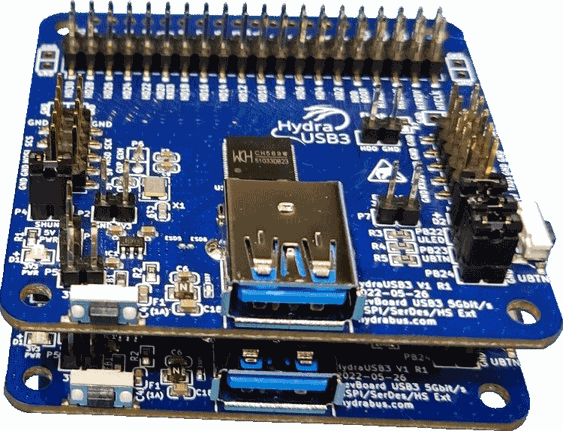
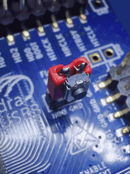

# Firmware and commands for HydraDancer 13 Mar 2023 Draft v0.2.2

# 1 HydraDancer Introduction

HydraDancer is a powerful platform for conducting pen testing on USB devices and USB hosts.

With its dual MCU and dual USB design, the HydraDancer offers unparalleled flexibility and versatility for evaluating the security of USB-based systems.
- The first USB port is based on USB3 SuperSpeed(5Gbps) (with fallback to USB2 HighSpeed 480Mbps) and is intended for use with an Evaluator PC or Evaluator Host.
- The second USB port is based on USB2 LS/FS/HS or USB3 SuperSpeed and is intended for use with the Target of Evaluation (ToE), which can be a USB Host or USB Device.

Whether you're a cybersecurity professional or a researcher, the HydraDancer is the perfect tool for testing the security of USB-based systems.

## 1.1 HydraDancer Hardware
The HydraDancer hardware use for development 2x HydraUSB3 boards connected together
- 

- SerDes shall be connected between 2 boards

   | HydraUSB3 Board1 Top | HydraUSB3 Board2 Bottom |
   |:--------------------:|:-----------------------:|
   | SerDes P6 GXM        | SerDes P6 GXM           |
   | SerDes P6 GXP        | SerDes P6 GXP           |

To flash Top or Bottom Board only top board Flash Jumper P3 shall be set(as it short HD0 to GND on both boards)
- Note: After flashing remove the jumper to avoid issues with HSPI communication (as P3 jumper short HD0 to GND)

A good hint(from Philippe Teuwen) is to solder a PushButon on a Jumper to short GND to HD0 when pressing the Button then reset the board to enter easily in USB bootloader mode.
- 

## 1.2 HydraDancer Firmware

DualBoard Firmware (same binary firmware for both boards)
- Firmware HydraUSB3 Board1(Top) connected to Evaluator Host
  - PB24 Jumper Present (to detect it is the part for Evaluator Host communication to be executed)
  - All BBIO commands to be detected from USB are directly restransmitted to Target Board over HSPI
  - Check regularly(Under IRQ or polling to be checked) if there is data on SerDes(coming from Target)
    - If data are present simply transfer them to Evaluator Host over USB

- Firmware HydraUSB3 Board2(bottom) Emulation Board connected to Target of Evaluation(ToE)
  - PB24 Jumper NOT Present (To detect is it the Emulation Board connected to ToE)
  - Protocol using BBIO defined hereafter

## 1.3 HydraDancer communication

HydraDancer communication use different physical links to be as fast as possible with lowest possible latency.
All is done with DMA and when possible with zero copy.

### 1.3.1 HydraDancer communication global view

| Evaluator PC    | HydraUSB3 Board1 Top | Inter-board | HydraUSB3 Board2 Bottom | Target of Evaluation(ToE)   |
|:---------------:|:--------------------:|:-----------:|:-----------------------:|:---------------------------:|
| Evaluator Host  | <= Control Board =>  | HSPI =>     | <= Emulation Board  =>  | Target Host / Target Device |
|                 |                      | <= SerDes   |                         |                             |

- "Emulation board" is emulating a Device when auditing a Target Host, and is emulating a Host when auditing a Target Device.
"Emulation board" emulating a Device to audit a Target Host" is the priority.

- "Control Board" (on Board1) shall use exclusively USB3 SuperSpeed(5Gbps) to be as quick as possible with lowest possible latency
  - Potentially a fallback to USB2 HighSpeed(480Mbps) shall be possible.
  - The firmware/host tools to communicate to the Board1 which support USB3 SS/USB2 HS can be based on existing firmware https://github.com/hydrausb3/hydrausb3_fw/tree/main/HydraUSB3_USB & host tools https://github.com/hydrausb3/hydrausb3_host

### 1.3.2 HydraDancer communication Evaluator PC <=> Control Board (Board1)

USB Bulk Endpoints configuration
* Endpoint1 is used for command/answer with 4KiB buffer(IN) and 4KiB buffer(OUT)
  * This Endpoint use 4 burst over USB3 (4KiB)
* Endpoint2 is used for fast USB streaming with 4KiB buffers(IN/OUT)
  * This Endpoint use 4 burst over USB3 (4KiB)
  * This endpoint is used to transceive data between Evaluator PC and ToE (passing through differents layers)
* Endpoint3 to 5 are reversed and not used so far
* Endpoint6 is used for fast USB streaming for debug log/traces from Board1 with 4KiB buffers(IN/OUT)
  * This Endpoint use 4 burst over USB3 (4KiB)
* Endpoint7 is used for fast USB streaming for debug log/traces from Board2 with 4KiB buffers(IN/OUT)
  * This Endpoint use 4 burst over USB3 (4KiB)

### 1.3.3 HydraDancer communication Evaluator Inter-board (Board1/Board2)


### 1.3.4 HydraDancer communication Emulation Board (Board2) <=> ToE


# 2. HydraDancer BBIO protocol format

The BBIO protocol is used only on Board2
Note: Board1 send & receive data(over HSPI/SerDes) to Board2 without analyzing anything inside in a transparent way.


## 2.1 Struture of the BBIO Protocol

The BBIO protocol works with a pair of packets/transactions :
- The first packet describes the command
- The second packet is the payload associated with the command

When the command has no payload attached a dummy packet shall be sent.

Note that after each packet sent the return code must be querried.
A return code of 0 indicates a success, whereas a return code different than 0 is specific to the issue.

A complete transaction could look like this :
```
usb_transfer(EP1OUT, bbioCommandSetDescriptor)
returnCode = usb_transfer(EP1IN)
usb_transfer(EP1OUT, payload)
returnCode = usb_transfer(EP1IN)
```


## 2.1.1 Structure of the command

- 8 bits Command
- 8 bits SubCommand (optional)
- Additional data related to the Command/SubCommand (optional)


### 2.1.1.1 BBIO Commands

|  Command          |  Value         |  Comment                  |
|-------------------|----------------|---------------------------|
|  BbioMainMode     |  0b00000001    | Unused                    |
|  BbioIdentifMode  |  0b00000010    | Unused                    | 
|  BbioSetDescr     |  0b00000011    | Requires a SubCommand     | 
|  BbioSetEndp      |  0b00000100    | Requires additional datas | 
|  BbioConnect      |  0b00000101    |                           | 
|  BbioGetStatus    |  0b00000110    |                           | 
|  BbioDisconnect   |  0b00000111    |                           | 
|  BbioResetDescr   |  0b00001000    |                           | 


### 2.1.1.2 BBIO SubCommands

|  Command                   |   Value         |  Comment                     |
|----------------------------|-----------------|------------------------------|
|  BbioSubSetDescrDevice     |   0b00000001    | Associated with BbioSetDescr | 
|  BbioSubSetDescrConfig     |   0b00000010    | Associated with BbioSetDescr | 
|  BbioSubSetDescrInterface  |   0b00000011    | Not Implemented \*           | 
|  BbioSubSetDescrHidReport  |   0b00000100    | Associated with BbioSetDescr | 
|  BbioSubSetDescrHubReport  |   0b00000101    | Associated with BbioSetDescr | 
|  BbioSubSetDescrEndpoint   |   0b00000110    | Not Implemented \*           | 
|  BbioSubSetDescrString     |   0b00000111    | Associated with BbioSetDescr | 

\* When setting the configuration descriptor, the whole tree is sent, thus the interface and endpoint descriptors are already sent.


### 2.1.1.3 BBIO Addtional datas

#### BbioSetEndp

An array of bytes 0-terminated.
Each byte describing an endpoint to set.

The structure of a byte describing an endpoint is as follow :
```
0b00yy Xxxx
```

Where yy correspond to the mode : (Not used as of now)
- 01: isochronous
- 10: bulk
- 11: interrupt

And Xxxx correspond to the endpoint number
- X: 0 for OUT, 1 for IN
- xxx: the endpoint number (from 1 to 7)


# 3 Enumeration and Fuzzing

When enumerating a device the following happens :
```
bbio_set_descriptor_device()
bbio_set_descriptor_configuration()
bbio_set_descriptor_endpoints()
bbio_connect()
bbio_get_status()   // Is our device supported ?
```

Fuzzing can be seen as enumerating a device with faulted/altered field(s).


Warning the device is limited in memory to be checked what is possible with remaining XRAM (as lot of KB are reserved for different devices HSPI, SerDes, USB2/USB3)
- It will requires a basic memory allocator for that purpose to optimize memory (and avoid memory fragmentation) as much as possible.
  - See https://github.com/hydrausb3/HydraDancer/issues/20 "Add memory pool allocator"
  - If there is no enough memory available each command shall returns an error (usually 0x01)

## Future
An other HydraUSB3 USB Device fuzzing passthrough mode shall be studied(with potentially MITM features to be added/configured)
This mode could be used for lowlevel USB enumeration/pipe fuzzing with invalid descriptors including invalid index ... (worst case everything is wrong to test the Target robustness...)

=> PC Host Target packets will be transparently transceived from/to PC Host Attacker which will analyze the data and reply as fast as possible.
