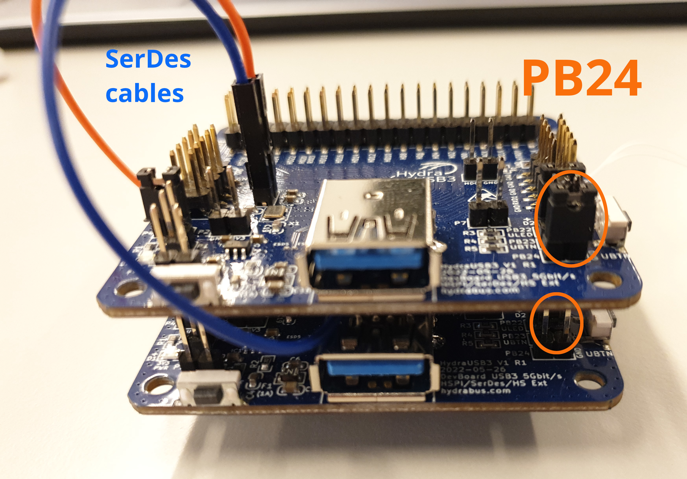
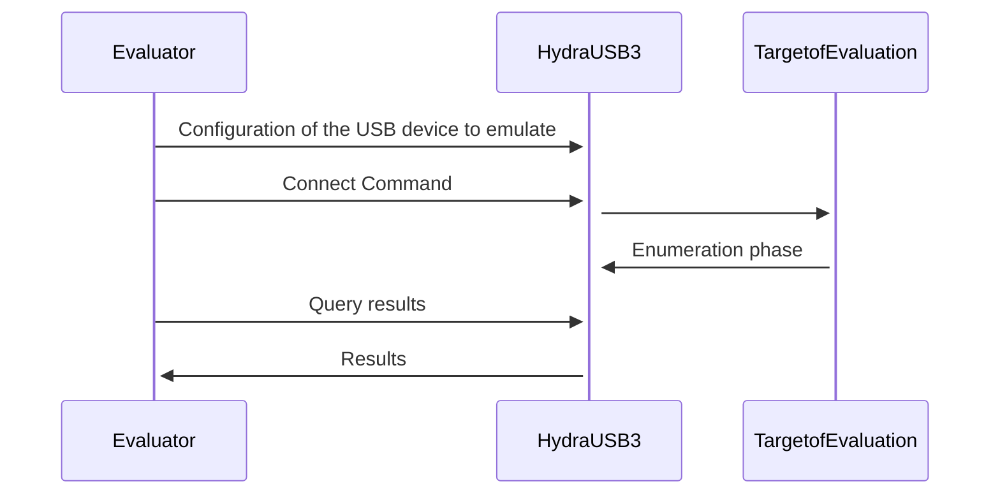

# enumeration

This firmware aims to offer the enumeration capability of umap (with the facedancer).


## DISCLAIMER !

Ensuring a device is supported by the ToE can be done in 2 ways :
- During the enumeration phase (enumeration as in the spec.), a device can be considered supported when the ToE sends a `setConfiguration()` to the device (the last command issued during the enumeration phase).
- Waiting to receive a packet on a given endpoint (other than endpoint 0).

Here we choose the first option, note that it might have false positives, as it is the case on linux hosts (linux hosts always sends the `setConfiguration()` even if no driver were loaded).

To be more exhaustive both mode should be implemented to let the choice of the method to the final user.


## Prerequisites

To build and flash the firmware, get either the MRS toolchain or the GNU RISC-V toolchain repacked by HydraUSB3 team. More info here: [Linux](https://github.com/hydrausb3/hydrausb3_fw/wiki/how-to-build-flash-and-use-examples-on-linux), [Windows](https://github.com/hydrausb3/hydrausb3_fw/wiki/how-to-build-flash-and-use-examples-on-windows)

To build and run the host-controller, get the following dependencies:
- pkg-config
- libusb (1.0.X developer)

### MRS toolchain
```shell
wget http://file.mounriver.com/tools/MRS_Toolchain_Linux_x64_V1.50.tar.xz
mkdir -p MRS_Toolchain_Linux_x64_V1.50
tar xf MRS_Toolchain_Linux_x64_V1.50.tar.xz --directory=MRS_Toolchain_Linux_x64_V1.50
```
To use it, add it to your path.
```
export PATH="$PATH:$(pwd)/MRS_Toolchain_Linux_x64_V1.50/RISC-V Embedded GCC/bin"
```
### GCC RISC-V 12.2 toolchain

Get the latest release from https://github.com/hydrausb3/riscv-none-elf-gcc-xpack/releases , e.g.:

```shell
wget https://github.com/hydrausb3/riscv-none-elf-gcc-xpack/releases/download/12.2.0-1/xpack-riscv-none-elf-gcc-12.2.0-2-linux-x64.tar.gz
tar xf xpack-riscv-none-elf-gcc-12.2.0-2-linux-x64.tar.gz
```
To use it, add it to your path.
```shell
export PATH="$PATH:$(pwd)/xpack-riscv-none-elf-gcc-12.2.0-1/bin"
```

## Physical configuration

- Add a jumper on PB24 on the top board (used by the firmware to determine if it is top or bottom board)
- Connect SerDes together (GXP to GXP and GXM to GXM, see the following picture)



If you feel capable, you can also desolder the PB24 header on the top board and solder a female header on the other side of the board, so both PB24 jumpers will be connected together.

## Permissions

To be able to access the HydraDancer boards and flash them, root privileges may be required, or you can provide them to your regular user, e.g. with the creation of a file `/etc/udev/rules.d/99-hydrausb3.rules` with
```
# UDEV Rules for HydraUSB3 boards, https://github.com/hydrausb3
# WinChipHead CH569W Bootloader
SUBSYSTEMS=="usb", ATTRS{idVendor}=="4348", ATTRS{idProduct}=="55e0", MODE="0664", GROUP="plugdev"
```
and having your user as member of the group `plugdev`.
## Firmware Compilation
Get and build the flashing tool
```shell
git clone https://github.com/hydrausb3/wch-ch56x-isp.git
cd wch-ch56x-isp
make
cd -
```
Get the HydraDancer sources
```shell
git clone --recursive https://github.com/hydrausb3/HydraDancer.git
cd HydraDancer
```
Note: if already you cloned it without `--recursive`, you can fix it with
```shell
git submodule init
git submodule update
```
Building and flashing firmware
```shell
cd enumeration/firmware
make clean all
```
## Firmware Flashing
Set top board in Flash Mode.
With a jumper on P3:

* Put a jumper on the top board (both boards are connected to the same jumper)
* Press & release reset button of the top board

Or with a button or momentary short on P3:

* Press Flash mode button (common to both boards)
* Press & release reset button of the top board
* Release Flash mode button

Warning! You have 10 seconds to flash the board! Note: root privileges may be required, see above.
```shell
../../../wch-ch56x-isp/wch-ch56x-isp -v flash ./build/HydraDancer-enumeration-fw.bin
```


Press & release reset button of the top board again to leave Flash Mode. If you used a jumper, don't forget to remove it before resetting the board!


Repeat the same procedure with the bottom board. (exact same procedure but press the bottom board reset button)

## Host Controller Software Compilation
```shell
cd ../host-controller
make clean all
```

## Running Host Controller Software
```shell
./build/host-controller
```
Note: root privileges may be required, see above.

The enumeration is done through `host-controller`, you can either enumerate one by one manually or use _automode_ to automatically enumerate every device already implemented.


## Global overview

To know if a device is recognized by the host ToE (Target of Evaluation) we behave as a USB device until the host ToE sends us a `setConfiguration()`.

The top board is connected to the Evaluator (the computer running the evaluation) and the bottom board to the ToE.

The `host-controller` is the software running on the Evaluator. It controls the enumeration process.

The enumeration process works as follow :

<!------>

### Limitations

- Currently only the enumeration phase is done, there is no communication with the driver once the enumeration is done.

- The configuration (descriptors) of the device has to be uploaded before "connecting" (with BBIO command, not physically). It can not be sent "on the fly", while the enumeration is ongoing.


Addtional informations can be found here: [BBIO_CMD_HydraDancer](https://github.com/hydrausb3/HydraDancer/blob/main/docs/BBIO_CMD_HydraDancer.md).


## Adding devices to enumeration

Adding devices to enumerations is done in `host-controller`.

To add a device to enumeration (automode) you need to :
- add the descriptors in `usb_descriptors.c`
    - add an array for the device descriptor
    - add an array for the configuration descriptor (The whole tree !)
    - add those arrays in a `struct Device_t`
- add this struct in `g_devices` (At the bottom of `usb_descriptors.c`)

The following generic device can be copy-pasted and adapted to create a new device :
```C
/*******************************************************************************
 * DEVICE GENERIC
 */
unsigned char _genericDescriptorDevice[] = {
    0x12,   // bLength
    DEV_DESCR_DEVICE,   // bDescriptorType
    0x00,   // bcdUSB (low)
    0x02,   // bcdUSB (high)
    0x00,   // bDeviceClass (Defined in the interface descriptor)
    0x00,   // bDeviceSubClass
    0x00,   // bDeviceProtocol
    64,     // bMaxPacketSize0
    0x34,   // idVendor (low)
    0x12,   // idVendor (high)
    0xCD,   // idProduct (low)
    0xAB,   // idProduct (high)
    0x00,   // bcdDevice (low)
    0x42,   // bcdDevice (high)
    0x00,   // iManufacturer
    0x00,   // iProduct
    0x00,   // iSerialNumber
    0x01,   // bNumConfigurations
};

unsigned char _genericDescriptorConfig[] = {
    //  Descriptor Config
	0x09, // bLength
	DEV_DESCR_CONFIG, // bDescriptorType
	0x19, // wTotalLengthL
	0x00, // wTotalLengthH
	0x01, // bNumInterfaces
	0x01, // bConfigurationValue
	0x00, // iConfiguration
	0x80, // bmAttributes
	0x64, // MaxPower
    //  Descriptor Interface
	0x09, // bLength
	DEV_DESCR_INTERF, // bDescriptorType
	0x00, // bInterfaceNumber
	0x00, // bAlternateSetting
	0x01, // bNumEndpoint
	0x00, // bInterfaceClass
	0x00, // bInterfaceSubClass
	0x00, // bInterfaceProtocol
	0x00, // iInterface
    //  Descriptor Endpoint
	0x07, // bLength
	DEV_DESCR_ENDP, // bDescriptorType
	0x01, // bEndpointAddress (OUT)
	0x02, // bmAttributes
	0x00, // wMaxPacketSizeL
	0x02, // wMaxPacketSizeH
	0x00, // bInterval
};

struct Device_t g_deviceGeneric = { "Generic", _genericDescriptorDevice, _genericDescriptorConfig, NULL };
```


## Common issues

- Make sure to have the proper toolchain for RISC-V, instructions can be found here [for Linux](https://github.com/hydrausb3/hydrausb3_fw/wiki/how-to-build-flash-and-use-examples-on-linux) and [for Windows](https://github.com/hydrausb3/hydrausb3_fw/wiki/how-to-build-flash-and-use-examples-on-windows).

- Do not forget to clone the submodules. If not yet done, you can fix it with `git submodule init && git submodule update`.

- "Fail to open device 4348:55e0": As mentioned in _How to flash_, when connecting the board (in flash mode) you have 10 seconds to flash it, after that delay it swaps back to the firmware already present on the board. Ensure device is plugged and in flash mode, additionally it can be a permissions issue, try as root.

- "Error USB device not found": ensure device is plugged and not in flash mode, additionally it can be a permissions issue, try as root.
