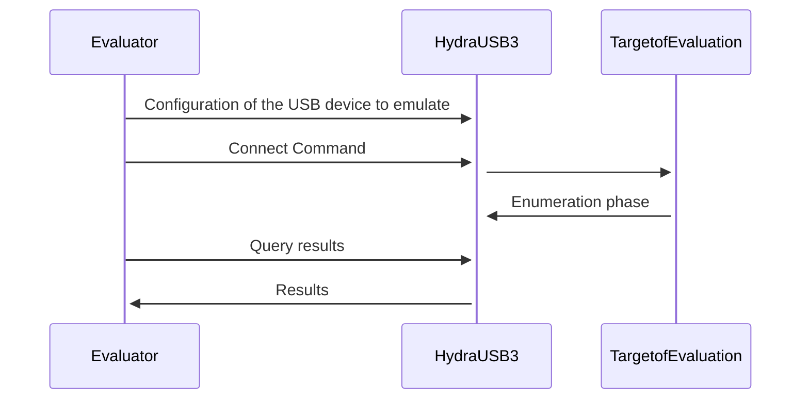

# enumeration

This firmware aims to offer the enumeration capability of umap (with the facedancer).


## DISCLAIMER !

Ensuring a device is supported by the ToE can be done in 2 ways :
- During the enumeration phase (enumeration as in the spec.), a device can be
  considered supported when the ToE sends a `setConfiguration()` to the device
  (the last command issued during the enumeration phase).
- Waiting to receive a packet on a given endpoint (other than endpoint 0).

Here we choose the first option, note that it might have false positives, as it
is the case on linux hosts (linux hosts always sends the `setConfiguration()`
even if no driver were loaded).

To be more exhaustive both mode should be implemented to let the choice of the
method to the final user.


## How To Use

### Build and Flash the firmware on both boards
```
$ cd ./firmware

$ make clean all
$ /path/to/wch-ch56x-isp -v flash /path/to/build/hydrausb3-enumeration.bin
```
More explanations about how to flash can be found here :
* [Linux  ](https://github.com/hydrausb3/hydrausb3_fw/wiki/how-to-build-flash-and-use-examples-on-linux)
* [Windows](https://github.com/hydrausb3/hydrausb3_fw/wiki/how-to-build-flash-and-use-examples-on-windows)

### Build and run `host-controller`
```
$ cd ./host-controller

$ make clean all
$ ./build/host-controller
```
Note: root privileges may be required.

The enumeration is done through `host-controller`, you can either enumerate one
by one manually or use _automode_ to automatically enumerate every device
already implemented.


## Global overview

To know if a device is recognized by the host ToE (Target of Evaluation) we
behave as a USB device until the host ToE sends us a setConfiguration().

The top board is connected to the Evaluator (the computer running the
evaluation) and the bottom board to the ToE.

the `host-controller` is the software running on the Evaluator. It controls the
enumeration process.

The enumeration process works as follow :

<!------>


Addtional informations can be found here :
[BBIO_CMD_HydraDancer](https://github.com/hydrausb3/HydraDancer/blob/main/docs/BBIO_CMD_HydraDancer.md)


## Adding devices to enumeration

To add a device to enumeration (automode) you need to :
- add the descriptors in `usb_descriptors.c`
    - add an array for the device descriptor
    - add an array for the configuration descriptor (The whole tree !)
    - add those arrays in a `struct Device_t`
- add this struct in `g_devices` (At the bottom of `usb_descriptors.c`)

The following generic device can be copy-pasted and adapted to create a new device :
```C
/*******************************************************************************
 * DEVICE GENERIC
 */
unsigned char _genericDescriptorDevice[] = {
    0x12,   // bLength
    DEV_DESCR_DEVICE,   // bDescriptorType
    0x00,   // bcdUSB (low)
    0x02,   // bcdUSB (high)
    0x00,   // bDeviceClass (Defined in the interface descriptor)
    0x00,   // bDeviceSubClass
    0x00,   // bDeviceProtocol
    64,     // bMaxPacketSize0
    0x34,   // idVendor (low)
    0x12,   // idVendor (high)
    0xCD,   // idProduct (low)
    0xAB,   // idProduct (high)
    0x00,   // bcdDevice (low)
    0x42,   // bcdDevice (high)
    0x00,   // iManufacturer
    0x00,   // iProduct
    0x00,   // iSerialNumber
    0x01,   // bNumConfigurations
};

unsigned char _genericDescriptorConfig[] = {
    //  Descriptor Config
	0x09, // bLength
	DEV_DESCR_CONFIG, // bDescriptorType
	0x19, // wTotalLengthL
	0x00, // wTotalLengthH
	0x01, // bNumInterfaces
	0x01, // bConfigurationValue
	0x00, // iConfiguration
	0x80, // bmAttributes
	0x64, // MaxPower
    //  Descriptor Interface
	0x09, // bLength
	DEV_DESCR_INTERF, // bDescriptorType
	0x00, // bInterfaceNumber
	0x00, // bAlternateSetting
	0x01, // bNumEndpoint
	0x00, // bInterfaceClass
	0x00, // bInterfaceSubClass
	0x00, // bInterfaceProtocol
	0x00, // iInterface
    //  Descriptor Endpoint
	0x07, // bLength
	DEV_DESCR_ENDP, // bDescriptorType
	0x01, // bEndpointAddress (OUT)
	0x02, // bmAttributes
	0x00, // wMaxPacketSizeL
	0x02, // wMaxPacketSizeH
	0x00, // bInterval
};

struct Device_t g_deviceGeneric = { "Generic", _genericDescriptorDevice, _genericDescriptorConfig, NULL };
```
